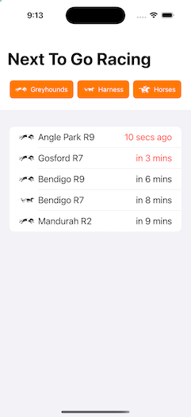

# DemoRacing
 
DemoRacing is an iOS app that fetches and displays a list of upcoming races from the Neds API.

## Required Tools

- Xcode 16 or later
- Minimum deployment iOS 18
- SwiftLint 

## Architecture 
Refer [Architecture](Architecture.md)

## Building and Running

- Open the `DemoRacing.xcodeproj` in Xcode
- Use the `DemoRacing` scheme to build the application and unit tests

DemoRacing will launch the "Next To Go Racing" screen with the next 5 upcoming races.
By default all race categories of greyhound, horse and harness are selected.

IMPROVEMENT: Save the selected categories in local persistant storage as it might be likely that these selections are preferred by the user.

Tapping the category buttons will toggle the selected category and update the upcoming races.

### Accessibility

The race category buttons will dynamically adjust from a horiontal to a vertical layout for large text sizes.

The upcoming races list will annouce the category name, meeting name, race number and time to advertised start when Voice Over is enabled.
